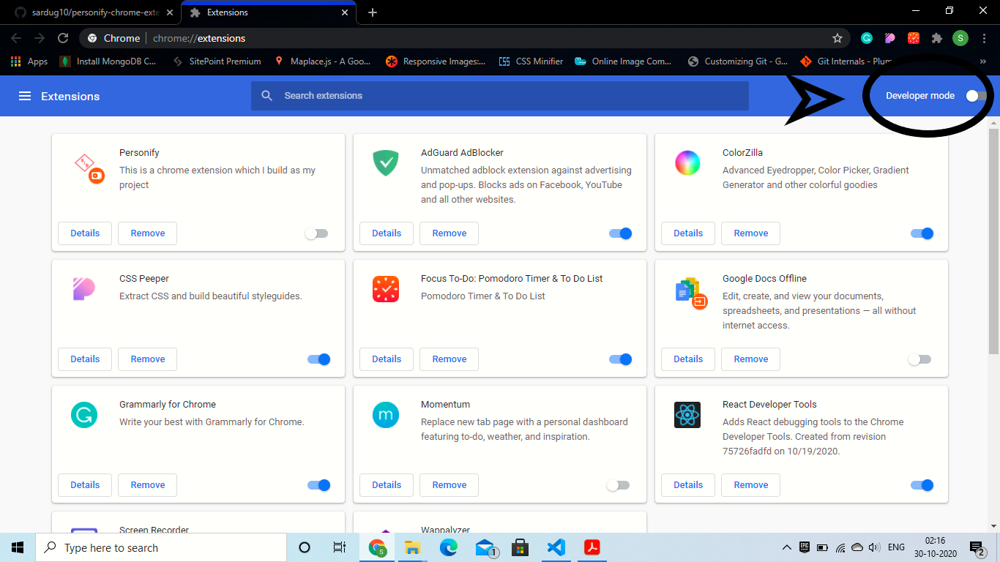
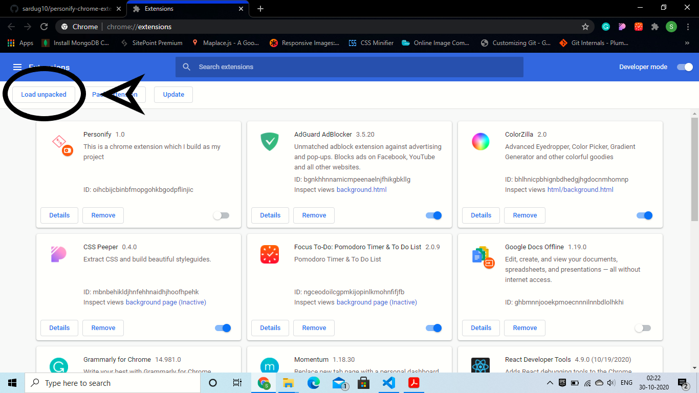
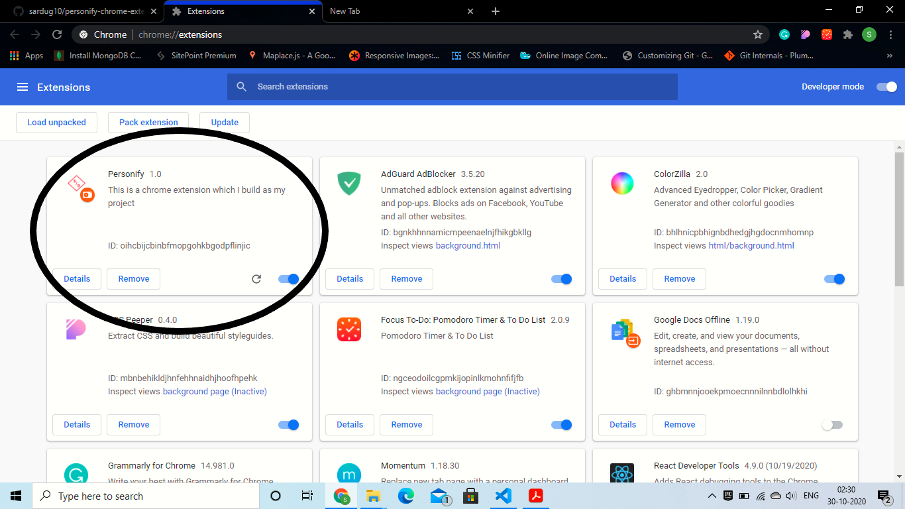
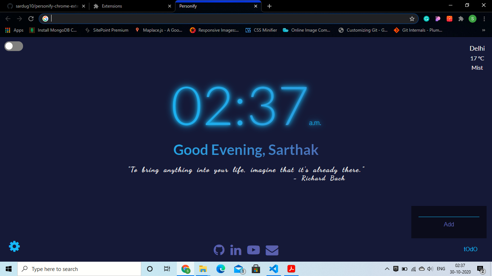

### Personify
This is a **Chrome Extension** which overrides chrome's new tab and have following features :-
> 1) Shows time with a salutation and a different inspirational quote on every refresh.
> 2) Shows weather of any city (by-default set to Delhi) but can be changed and name can also be changed.
> 3) It helps you maintain a todo-list which will remain intact in every situation. and last but not the least...my favorite part- toggles between light and dark mode. 

#### Instructions to use
1) Download the **css & js folder**, index.html, sarthakIcon.png and manifest.json file and place it in a folder and name it anything. The folder structure should look like this.
    Extension Folder :-
        1) css (folder)
        2) js (folder)
        3) index.html (file)
        4) manifest.json (file)
        5) sarthakIcon.png (png image)

    ##### Note: Don't forget to put manifest.json file otherwise chrome won't read that folder as an extension.

2) Open your chrome and enter **chrome://extensions** in the search bar or you can go to settings and then navigate to the **Extensions** option at the bottom left of the screen. You should see a screen like shown below.

3) Next, you will see an option **Developer mode** on the top right corner, enable it.

4) After enabling that, 3 options will appear at the top left corner and click on **Load unpacked**.

5) After you click on that option, file explorer will open and all you have to do now is to select the folder that you created in the 1st step. A new UI element like your all other extension (if any loaded) will be created like shown. The last thing, you have to do is to enable that extension by enabling the button at the bottom right corner.

#### Your Extension has been enabled, you can try it by opening a new tab and it should show something like this ( except obviously no name will appear as of now. )

##### Note:- You can change or add the Name and City by clicking the 'Settings' icon at the bottom left corner. Now you can play with it.

### How to contribute?
You can contribute to this extension by cloning the whole project but don't forget to delete the **bundle.js** under **dist --> js** and the **index.html** under the same **dist** folder because these two are the production files.

All the required **npm scripts** are in **package.json** file which will start the **development server** or can bundle the files etc.

##### All the contribution lies on your imagination.
